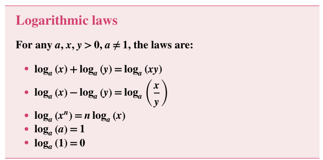

## Linear Equation
- $7x + 17 = 4$
<br/><br/>

- $2\left(\frac{4x}{5} -1 = 6 \right)$
<br/><br/> 

- $\frac{3-x}{4} = \frac{9\left(x + 7\right)}{10} + 1$
<br/><br/>


## Exponential

- $a^0 = $ <br/><br/>

- $a^2 * a^3 = $ <br/><br/>

- $\frac{a^2}{a^3} = $ <br/><br/>

-  $a^n + a^n = $ <br/><br/>

- $2a^n - 5a^n = $ <br/><br/>

- $a^{-1} =  $ <br/><br/>

- find the value of x: $2^x = \frac{1}{8}$  


## Logarithmic

```math
b = a^x \ \ \  <=> \ \ \ x = Log_a{b}
```
<br/>


#### exponents and logarithms :

- $3^2=9 \ \ <=> \ \ $ <br/><br/>

- $3 = Log_4{64} \ \ <=> \ \ $ <br/><br/>


#### Logarithmic law



#### Evaluate; let x = unknown

- $Log_6{216}$ =  <br/><br/>

- $2Log_3{27}$ = <br/><br/>

- 


